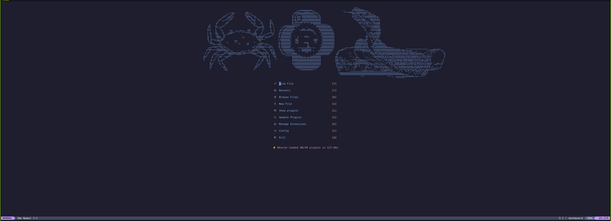
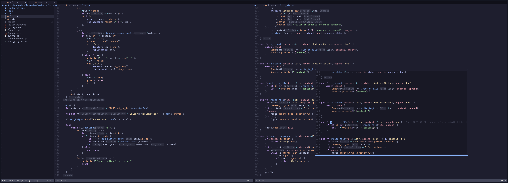

# Neovim Configuration Guide

Todo:

- [ ] **update this documentation keybindings.**

_This is a **starter configuration** for Neovim, featuring a curated selection of the most useful plugins for **Python** and **Rust** development.
It's designed to be lightweight and easy to customize, providing a strong foundation for both beginners and experienced developers. Feel free to tweak or extend it to suit your workflow._





_A basic set of key mappings is included and located in `lua/keymaps.lua`. You can review and customize these mappings to align with your personal preferences._

## Prerequisites

Before proceeding, ensure you meet the following requirements:

Neovim Version: `v0.10.2 - v0.10.4`  
Operating System: `Rocky Linux 9.4`, `PopOS 22.04`, `Debian 12.9`

Notes for `Mac` and `Windows` Users

**Mac Users:** If you're struggling to optimize your workflow, don’t worry—you have plenty of money to waste. Just buy a newer Mac instead!  
**Windows Users:** Before searching for a real IDE, you might want to get yourself a real operating system.

## Dependencies:

Ensure the following dependencies are installed for a seamless experience:

- **Ripgrep** (for Telescope):

  ```bash
  sudo dnf install ripgrep
  ```

- **Python venv** (for Python-based plugins):  
  Replace `<minor>` with your Python minor version:

  ```bash
  sudo dnf install python3.<minor>-venv
  ```

- **Clipboard provider** (e.g., xclip):

  ```bash
  sudo dnf install xclip
  ```

- **Node.js & npm** (for LSP support via `nvm`):  
  [Install nvm from GitHub](https://github.com/nvm-sh/nvm).

- **Prettier** (for yaml,js,... formatting)
 ```bash
 npm install -g prettier
 ``` 

## Useful Commands

- **Check Telescope health:**  
  In Neovim:

  ```vim
  :checkhealth telescope
  ```

- **Save without formatting:**

  ```vim
  :noautocmd write
  ```

- **Install formatters, debuggers, etc. (via Mason):**
  ```vim
  :Mason
  ```

## How to install:

```bash
$ cd ~/.config/nvim
$ git clone git@github.com:pykeras/neovim.git .
$ nvim
```

---

## Key Bindings

**Leader Key `<leader>`:**
The leader key is mapped to the spacebar (<Space>).

### General

- **Which Key (Help Menu):** Press `<leader>` to see available shortcuts.
- **Copy to clipboard:** `<leader>y`
- **Paste from clipboard:** `<leader>p`
- **Easier switching between splits:**
  - _Move to the left split:_ `<C-h>`
  - _Move to the right split:_ `<C-l>`
  - _Move to the upper split:_ `<C-k>`
  - _Move to the lower split:_ `<C-j>`
- **Toggle relative line numbers:** `<leader>rl`

---

### Virtual Environment Selector (Python)

_By default if you have `.venv` in project directory this setup will use that otherwise:_

- **Open selector**: `<leader>vs`
- **Select cached one**: `<leader>vc`

---

### Debugging

_For python make sure you run `pip install debugpy` in the virtualenv detected/selected._

- **Step into:** `<F2>`
- **Step over:** `<F3>`
- **Step out:** `<F4>`
- **Continue/Start debugging:** `<F5>`
- **Toggle breakpoint:** `<Leader>b`
- **Set conditional breakpoint:** `<F6>`
- **Terminate debugger:** `<F7>`
- **Run last debugging session:** `<F8>`

---

### Rustaceanvim

- **Show testable functions:** `<leader>rdt`

---

### Telescope

- **Search files:** `<leader>ff`
- **Live grep files:** `<leader>fg`

---

### NeoTree (File Explorer)

- **Open/Close NeoTree:** `<leader>e`

---

### LSP Configuration

- **Show documentation:** `K`
- **Go to definition:** `gd`
- **Go to definition (vertical split):** `<leader>gdv`
- **Go to definition (horizontal split):** `<leader>gds`
- **Peek definition:** `<leader>gdp`
- **Close all splits except current:** `<leader>qo`
- **Code actions:** `<leader>ca`
- **Show method signature (Insert mode):** `ctrl+k`
- **Autocomplete menu (Insert mode):** `ctrl+x, ctrl+o`

---

### None-ls (Formatting)

- **File global formatting:** `<leader>gf`

---

### Bufferline (Tabs)

- **Select buffer:** `<leader>bs`
- **Cycle next buffer:** `<Tab>`
- **Cycle previous buffer:** `<S-Tab>`
- **Move buffer left:** `<leader>bl`
- **Move buffer right:** `<leader>br`
- **Close buffer:** `<leader>bx`
- **Close all other buffers:** `<leader>bxa`

---

### Commenting

- **Single line comment:** `ctrl+/`
- **Multi-line comment (visual selection):** `ctrl+/`

---

### Todo Comments

- **View todo tree:** `<leader>tl`
- **View todos in Telescope:** `<leader>tt`

---

### Git Integration

- **Preview hunk:** `<leader>gp`
- **Git blame:** `<leader>gb`
- **Git log (oneline graph, custom):** `<leader>gl`

---

### Undo Tree

- **Open/Close undo tree:** `<leader>u`

---

### Session Management (Persisted)

- **Save session:** `<leader>ss`
- **List sessions:** `<leader>sl`
- **Delete session:** `<leader>sd`

---

### CodeSnap

- **Save to clipboard:** `<leader>cc`
- **Save to `~/Pictures`:** `<leader>cs`

---

### ToggleTerminal

- **Open/Close terminal:** `ctrl+\`
- **Exit terminal insert mode:** `<Esc>`
- **Open terminal below:** `<leader>th`
- **Open floating terminal:** `<leader>tf`
- **Send current line to terminal:** `<leader>tst`

---

### UFO (Folding)

- **Fold all:** `zR`
- **Unfold all:** `zM`
- **Toggle fold under cursor:** `za`

---

### Spelling

- **Display suggestions:** `z=`
- **Add word to dictionary:** `zg`

---

### Noice (Message Management)

- **Dismiss message:** `<leader>nd`
- **List messages:** `<leader>nl`

---

### Tabular (CSV/TSV View)

- **View CSV as table:** `<leader>csv`
- **View TSV as table:** `<leader>tsv`

---

### JSON Prettification

- **Prettify JSON:** `<leader>jp`

---

## Optional Features

### AI Integration (Avante)

- Ensure **LuaJIT** is installed.
- Rename `~/.config/nvim/lua/plugins/avante` to `avante.lua` for `Ollama`.

---
