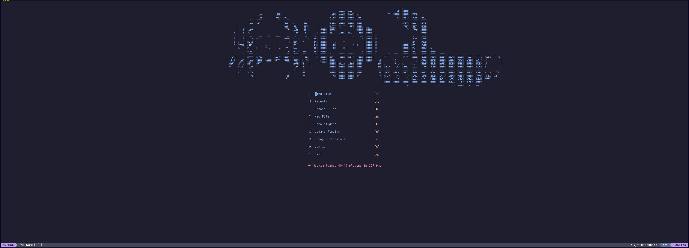
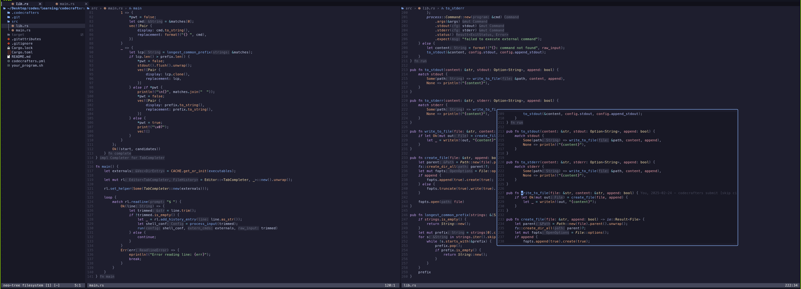

# Neovim Configuration Guide

__If you are updating from previous versions, please make sure to run :Lazy sync and :Mason to update everything.__

**Update: Aug 16, 2026** :snake:
> - New: **Python testing** with `neotest` + `pytest` — run and debug tests without leaving the editor (`<leader>n…`)
> - New: **Structural editing** via treesitter textobjects — select, jump and swap by function, class and argument (`vif`, `dac`, `]f`, `<leader>sa`)
> - New: **Persian / RTL support** — `:Persian` or `<leader>rtl`, with auto-detection for prose files
> - New: `trouble.nvim` workspace diagnostics, sticky context header, and scope indent guides
> - New: Python cheat sheet in Persian, opened with `<leader>hp`
> - Fix: removed a stray `pyright` setup that ran alongside `pyrefly`, causing duplicate diagnostics and hovers on every Python buffer
> - Fix: `dockerls`/`yamlls` were registered twice, the second time without `capabilities`, degrading completion
> - Fix: autosave used `wall`, rewriting every open buffer on each `TextChanged` and letting the formatter reformat background buffers mid-keystroke

**Update: Jul 6, 2026** 
> - Switching to `Pyrefly` instead `Mypy`
> - Minor bug fixes and tested with Neovim v0.12.4 

**Update: May 26, 2026** :sparkles:

> - New: `<C>-p` fuzzy file finder. 
>   - Searches all files under the Git project root, sorted by proximity to the currently open file.
> - Fix: `neo-tree` auto opening on focus

To enable copy/yank & paste over SSH using OSC52, add the following snippet **to the end of your `init.lua`**:

```lua
-- OSC52 clipboard integration for remote
-- Only enable when in a TTY session (e.g., SSH)
if vim.env.SSH_CONNECTION then
	local ok, osc52 = pcall(require, "vim.ui.clipboard.osc52")
	if ok then
		vim.g.clipboard = {
			name = "osc52",
			copy = {
				["+"] = osc52.copy("+"),
				["*"] = osc52.copy("*"),
			},
			paste = {
				["+"] = osc52.paste("+"),
				["*"] = osc52.paste("*"),
			},
		}
	end
end
```

[Source discussion](https://github.com/LazyVim/LazyVim/discussions/1565#discussioncomment-7173819)

⚠️ Note: Your terminal emulator must support `OSC52` clipboard sequences.

------

_This is a **starter configuration** for Neovim, featuring a curated selection of the most useful plugins for **Python**, **Rust** and **JavaScript** development. It's lightweight and highly customizable, suitable for both beginners and advanced users._





_A basic set of key mappings is included and located in `lua/keymaps.lua`. You can review and customize these mappings to align with your personal preferences._

## Prerequisites

Before proceeding, ensure you meet the following requirements:

Neovim Version: `v0.11.0+` (tested through `v0.12.4`)  
Operating System: `Rocky Linux 9.4`, `PopOS 22.04`, `Debian 12.9`, `Android with termux`

> ⚠️ **Neovim 0.11 is a hard requirement.** On 0.10 and earlier, `mason-lspconfig`
> v2 fails to load (it calls `vim.lsp.enable`, added in 0.11) and `venv-selector`
> raises on startup — the practical symptom is that **no LSP attaches to your
> Python buffers at all**. Check with `nvim --version` before filing an issue.

## Dependencies:

Ensure the following dependencies are installed for a seamless experience:

- **Ripgrep** (for Telescope and fzf file search):

  ```bash
  sudo dnf install ripgrep
  ```

- **fzf** (fuzzy finder binary required by the `<C-p>` file search):
  ```bash
  # Install via package manager (e.g., dnf)
  sudo dnf install fzf

  # Or install manually from https://github.com/junegunn/fzf
  ```

- **Python venv** (for Python-based plugins):  
  Replace `<minor>` with your Python minor version:

  ```bash
  sudo dnf install python3.<minor>-venv
  ```

- **Clipboard provider** (e.g., xclip):

  ```bash
  sudo dnf install xclip
  ```

- **Node.js & npm** (for LSP support via `nvm`):  
  [Install nvm from GitHub](https://github.com/nvm-sh/nvm).

- **Prettier** (for yaml,js,... formatting)
  ```bash
  npm install -g prettier
  ```

- `fd-find` is also needed for python virtualenv selector:
  ```
  sudo dnf install fd-find
  ```

- **Python toolchain** (for linting, formatting, testing and debugging):
  ```bash
  # uv — package/venv manager
  curl -LsSf https://astral.sh/uv/install.sh | sh

  uv tool install ruff      # linter + formatter (replaces black, isort, flake8)
  uv tool install pytest    # test runner driven by neotest

  # inside the project venv, for the debugger
  uv pip install debugpy
  ```

  Language servers themselves (`pyrefly`, `ruff`, …) are installed by Mason on
  first launch — check with `:Mason`.

## How to install:

  ```bash
  $ cd ~/.config/nvim
  $ git clone git@github.com:pykeras/neovim.git .
  $ nvim
  ```


## Useful Commands

- **Check Telescope health:**  

  ```vim
  :checkhealth telescope
  ```

- **Save without formatting:**

  ```vim
  :noautocmd write
  ```

- **Install formatters, debuggers, etc. (via Mason):**
  ```vim
  :Mason
  ```


---

## Key Bindings

**Leader Key `<leader>`:**
The leader key is mapped to the spacebar (<Space>).

### General

- **Which Key (Help Menu):** Press `<leader>` to see available shortcuts.
- **Copy to clipboard:** `<leader>y`
- **Paste from clipboard:** `<leader>p`
- **Easier switching between splits:**
  - _Move to the left split:_ `<C-h>`
  - _Move to the right split:_ `<C-l>`
  - _Move to the upper split:_ `<C-k>`
  - _Move to the lower split:_ `<C-j>`
- **Toggle relative line numbers:** `<leader>rl`
- **Reload all open files:** `<leader>re`
- __Clear search highlights:__ `Esc`
- __Escape insert mode:__ `jj`
- **Close all splits except current:** `<leader>qo`

---

### FZF File Finder (Proximity Search)

- **Open file in project (fuzzy, proximity-sorted):** `<C-p>`
  - Scopes search to the Git root (nearest parent `.git` up to `$HOME`).
  - Displays files relative to the project root; common parent directories are stripped for a cleaner view.
  - Sorted by directory distance from the currently open file, then alphabetically.
  - Requires `fzf` binary and `ripgrep`.

---

### Theme selection
_The default theme is set to `kanagawa-wave`; feel free to change it._
- Theme switcher menu: `tsm`
- Next theme: `tn`
- Previous theme: `tp`

---

### Virtual Environment Selector (Python)

_By default if you have `.venv` in project directory this setup will use that otherwise:_

- **Open selector**: `<leader>vs`
- **Select cached venv**: `<leader>vc`

---

### Testing (Neotest + pytest)

_Runs against the virtualenv selected with `<leader>vs`. If tests fail with
`ModuleNotFoundError`, select the environment first._

_Bindings live under `<leader>n…` rather than `<leader>t…`, which is already
shared by themes, terminals, todo-comments and tabular._

- **Run nearest test:** `<leader>nr`
- **Run current file:** `<leader>nF`
- **Run whole suite:** `<leader>na`
- **Re-run last:** `<leader>nL`
- **Debug nearest test:** `<leader>ndb` _stops on breakpoints_
- **Stop run:** `<leader>nx`
- **Show output of a failure:** `<leader>no`
- **Toggle output panel:** `<leader>np`
- **Toggle summary tree:** `<leader>ns`

---

### Structural Editing (Treesitter Textobjects)

_Operate on functions, classes and arguments instead of lines. Combine with
`v` (select), `d` (delete), `c` (change) or `y` (yank) — e.g. `dif` empties a
function body._

**Select**

- **Function:** `af` _outer_ / `if` _body_
- **Class:** `ac` / `ic`
- **Argument:** `aa` / `ia`
- **Loop:** `al` / `il`
- **Conditional:** `ai` / `ii`
- **Comment:** `a/`

**Move & swap**

- **Next/previous function:** `]f` / `[f`
- **Next/previous class:** `]c` / `[c`
- **Next/previous argument:** `]a` / `[a`
- **Swap argument with next:** `<leader>sa`
- **Swap argument with previous:** `<leader>sA`

---

### Diagnostics (Trouble)

- **Workspace diagnostics:** `<leader>xx`
- **Buffer diagnostics:** `<leader>xb`
- **Symbol outline:** `<leader>xs`
- **LSP references / definitions:** `<leader>xl`
- **Quickfix list:** `<leader>xq`
- **Next/previous diagnostic:** `]d` / `[d`
- **Next/previous error only:** `]e` / `[e`

---

### Python Refactoring

- **Rename symbol project-wide:** `<leader>rn` _semantic, unlike `:%s/`_
- **Organize imports:** `<leader>oi`
- **Ruff fix-all:** `<leader>fa`
- **Format buffer:** `rf` _formatting also runs on save_

---

### Debugging

_For python make sure you run `pip install debugpy` in the virtualenv detected/selected._

- **Step into:** `<F2>`
- **Step over:** `<F3>`
- **Step out:** `<F4>`
- **Continue/Start debugging:** `<F5>`
- **Toggle breakpoint:** `<Leader>b`
- **Set conditional breakpoint:** `<F6>`
- **Terminate debugger:** `<F7>`
- **Run last debugging session:** `<F8>`

---

### Flash (Navigation)

- **Flash jump (normal/visual/operator):** `s`
- **Flash Treesitter jump (normal/visual/operator)**: `S`
- **Remote Flash (operator mode):** `r`
- **Treesitter search (operator/visual mode):** `R`
- **Toggle Flash search (command-line mode):** `<C-s>`

---

### Rustaceanvim
* **Show testable functions:** `<leader>rdt`

---

### Telescope

- **Search files:** `<leader>ff`
- **Live grep files:** `<leader>fg`
- __Show TODOs (Telescope):__ `<leader>tt`
- __Show TODOs (loclist):__ `<leader>tl`

---

### NeoTree (File Explorer)

- **Open/Close NeoTree:** `<leader>e`
- __Reveal file in NeoTree:__ `<leader>E`
- __NeoTree filesystem:__ `<leader>nf`
- __Git status NeoTree:__ `<leader>gs`

---

### LSP Configuration

- **Hover documentation:** `K`
- **Go to definition:** `gd`
- **Go to definition (vertical split):** `<leader>gdv`
- **Go to definition (horizontal split):** `<leader>gds`
- **Peek definition:** `<leader>gdp`
- **Code actions:** `<leader>ca`
- **Show method signature (Insert mode):** `<C-k>`
- __Copy diagnostic message to clipboard:__ `<leader>cd`

---

### None-ls (Formatting)

- **File global formatting:** `<leader>gf`

---

### Bufferline (Tabs)

- **Select buffer:** `<leader>bs`
- **Cycle next buffer:** `<Tab>`
- **Cycle previous buffer:** `<S-Tab>`
- **Move buffer left:** `3bh` _move buffer left 3 times._
- **Move buffer right:** `3bl` _move buffer right 5 times._
- **Close buffer:** `<leader>bx`
- **Close all other buffers:** `<leader>bxa`
- __Jump to buffer based on position number:__ `<leader>num` _number can be 1 to 9_

---

### Commenting

- **Single line comment:** `ctrl+/`
- **Multi-line comment (visual selection):** `ctrl+/`

---

### Git Integration

- **Preview hunk (change):** `<leader>gp`
- **Git blame:** `<leader>gb`
- **Git log (oneline graph, custom):** `<leader>gl`
- __Git difference (file):__ `<leader>gfd` 

---

### Undo Tree

- **Open/Close undo tree:** `<leader>u`

---

### Session Management (Persisted)

- **Save session:** `<leader>ss`
- **List sessions:** `<leader>sl`
- **Delete session:** `<leader>sd`

---

### CodeSnap

- **Save to clipboard:** `<leader>cc`
- **Save to `~/Pictures`:** `<leader>cs`

---

### ToggleTerminal

- **Open/Close terminal:** `ctrl+\`
- **Open terminal below:** `<leader>th`
- **Open floating terminal:** `<leader>tf`
- **Send current line to terminal (run command from docs):** `<leader>tst`

---

### UFO (Folding)

- **Fold all:** `zR`
- **Unfold all:** `zM`
- **Toggle fold under cursor:** `za`

---

### Spelling

- **Display suggestions:** `z=`
- **Add word to dictionary:** `zg`

---

### Noice (Message Management)

- **Dismiss message:** `<leader>nd`
- **List messages:** `<leader>nl`

---

### Tabular (CSV/TSV View)

- **View CSV as table:** `<leader>csv`
- **View TSV as table:** `<leader>tsv`

---

### Persian / RTL Support

_Typing and editing Persian, with Neovim kept out of the way of the terminal's
own text rendering._

- **Toggle Persian mode:** `<leader>rtl` _or_ `:Persian`
- **Switch keyboard while typing:** `<C-^>` _insert mode; no need to leave Neovim_

Turning it on loads the standard Iranian keyboard layout and disables `spell` —
there is no Persian dictionary for Neovim, so every word would otherwise be
underlined. Harper, being an English grammar checker, is detached from Persian
buffers for the same reason.

Prose files (`.md`, `.txt`, `.tex`, `.org`, `.rst`) switch on automatically when
several of their first lines contain Persian script. The threshold is
deliberate: a Python file with one Persian comment is left alone.

**On display, and why `rightleft` is not used.** Neovim's own RTL features are
built for GUI rendering and actively make things worse in a terminal:

- `arabicshape` substitutes presentation-form glyphs and emits them in *visual*
  order, so words render backwards (`سلام` becomes `ﺱﻼﻣ` reversed). This config
  turns it off globally — it is a global option, not buffer-local, and it has no
  effect on Latin text.
- `rightleft` reverses the character cells itself, fighting whatever bidi the
  terminal implements. On VTE-based terminals (gnome-terminal) it blanks the
  line completely.

With both off, the buffer keeps its logical byte order and the terminal and font
do the shaping and reordering — which is the only combination that produces
readable Persian.

⚠️ **This means display quality is your terminal's job, not Neovim's.** Kitty,
WezTerm and Konsole shape and reorder Arabic-script text properly. **VTE-based
terminals (gnome-terminal, Tilix, Terminator) do not implement bidi at all**, so
Persian will appear unshaped and in logical rather than visual order no matter
how Neovim is configured. If Persian looks wrong, switch terminals before
changing any setting here.

---

### Cheat Sheet

- **Open the Python cheat sheet in your browser:** `<leader>hp`

A Persian-language reference for the Python workflow above —
environments, testing, debugging and structural editing — lives at
`docs/python-cheatsheet.html`.

---

## Optional Features

### AI Integration (Avante)

- Ensure **LuaJIT** is installed.
- Rename `~/.config/nvim/lua/plugins/avante` to `avante.lua` for `Ollama`.

---
